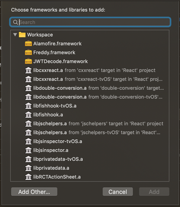

# react-native-waltz

React Native bridge for [Waltz's SDK](http://waltzapp.com)

## Installation

```bash
npm install --save react-native-waltz
```
Once the npm install is done, navigate to your iOS file and create/update your pod file

```
cd ios
#if you don't have already a podfile
pod init
```

Update your Podfile to look like this:
```ruby
#Podfile
platform :ios, '9.3'

# ignore all warnings from all pods
inhibit_all_warnings!

source 'https://github.com/WaltzApp/Podspecs.git'
source 'https://github.com/CocoaPods/Specs.git'

target 'YOUR_PROJECT' do
 
  use_frameworks!

  pod 'WaltzAccess', :inhibit_warnings => true

end

```

Run 

``` 
pod install
```

Link library by adding the `RNWaltz.xcodeproj` from node-modules/ to `YourProject.xcodeproj > Libraries`

After this open your project's workspace and do the following:

1. Go under `YourProject.xcodeproj > Libraries` and select the `RNWaltz.xcodeproj`

    

2. In the target's **Build Phases** go to `Link Binary with Libraries` and remove the reference to the old pods and add the new pods framework  

    

3. Go back to the main project's settings and under **Build Phases** add the `libRNWaltz.a` file. (If it doesn't show up automatically when trying to add it, you can find the file under `YourProject.xcodeproj > Libraries > RNWaltz.xcodeproj > Products`)

4. Lastly, under the main project's **Build Settings** search for `Library Search Paths` and add:

   `$(TOOLCHAIN_DIR)/usr/lib/swift/$(PLATFORM_NAME)`

   **make sure you set this as recursive**

**Build for device or generic device, this won't work on simulators**

## Usage

```javascript
import WaltzView from 'react-native-waltz'

<WaltzView/> // this shows modal with QRCode
 
```

## Road Map

- Android Bridge
- Geofencing
- Invites / Guests
- Custom Login

## Contributing
Pull requests are welcome. For major changes, please open an issue first to discuss what you would like to change.

## License
[MIT](https://choosealicense.com/licenses/mit/)
